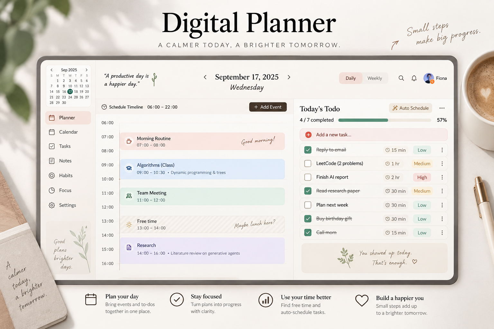

# 📖 Digital Planner — 極簡優雅個人數位手帳

[](https://digital-planner-1.ai.studio)
[](https://digital-planner-1.ai.studio)

> *“A productive day is a happier day.”*  
> 一款兼具溫潤紙本質感與現代智慧排程的數位手帳應用程式。結合直覺的時間軸排程、智慧待辦清單、柔和視覺音效與靈活的多用戶登入系統。

---

## 🌐 線上部署網址

* **正式生產環境（Production URL）**：[https://digital-planner-1.ai.studio](https://digital-planner-1.ai.studio)

---

## 📸 Demo 產品展示



> **主要畫面特色**：
> - **左側**：迷你月曆檢視（Mini Calendar）與 06:00 – 22:00 的精準時間軸排程（Schedule Timeline）。
> - **中右側**：即時進度條與「今日待辦（Today's Todo）」清單，支援多優先級標籤、預估時間與一鍵智慧排程。
> - **右側邊緣**：優雅質感的月份索引標籤（Index Tabs），營造如翻閱實體皮革手帳般的沉浸體驗。

---

## ✨ 核心特色與功能

### 1. 溫潤紙本美學（Paper-Craft Aesthetic）
- 採用溫暖奶茶色調、柔和圓角與模擬真實紙質微紋理，告別冰冷死板的傳統行事曆。
- 專屬設計的手帳翻頁索引、流暢動態轉場與沉浸式氛圍音效。

### 2. 智慧排程與待辦管理（Timeline & Smart Todo）
- **視覺化時間軸**：直覺拖曳與點擊新增日常行程（如晨間例行、課程、會議、專注研究）。
- **進度追蹤**：待辦項目完成率即時計算（動態完成百分比與進度條）。
- **Auto Schedule 智慧排程**：一鍵將尚未排入時間的待辦任務智慧填入空白時段。

### 3. 多用戶帳號與高可用性架構（Multi-Tier Storage）
- **完整權限與個人空間**：支援註冊新會員與多帳號快速切換，每個用戶擁有獨立的行事曆與任務狀態。
- **高可用性容錯設計**：
  - **記憶體即時快取（In-Memory Cache）**：保證請求毫秒級回應。
  - **磁碟與容器備援（Disk & `/tmp` Fallback）**：自動適應無狀態容器環境。
  - **Google Cloud SQL / Firestore 雙向支援**：支援雲端關聯式資料庫與 NoSQL 雲端同步。

---

## 🔑 預設示範帳號

您可直接於登入頁面點選「一鍵填入」或手動輸入示範帳號體驗：

| 角色 / 稱謂 | 登入 Email | 預設密碼 | 帳號權限 |
| :--- | :--- | :--- | :--- |
| **Fiona (手帳策劃師)** | `fiona930607@gmail.com` | `planner123` | Journal Curator / 完整權限 |
| **Alex (設計師)** | `alex@digitalplanner.app` | `planner123` | Designer |
| **Sarah (工程師)** | `sarah@digitalplanner.app` | `planner123` | Developer |

*亦可點擊「註冊帳號」自行建立全新的專屬手帳空間。*

---

## 🛠️ 技術堆疊

- **前端核心**：React 18 + TypeScript + Vite
- **介面樣式**：Tailwind CSS + Lucide Icons + Motion 動態庫
- **後端服務**：Express.js (Node.js) + TypeScript (`tsx` / `esbuild`)
- **資料庫與 ORM**：Drizzle ORM + PostgreSQL (Google Cloud SQL) + 本地 JSON 容錯儲存
- **雲端部署**：Google Cloud Run (Containerized Server + Vite SPA)

---

## 🚀 本地開發與建置

### 1. 安裝相依套件
```bash
npm install
```

### 2. 啟動本機開發伺服器
```bash
npm run dev
```
啟動後瀏覽器打開 `http://localhost:3000` 即可預覽。

### 3. 生產環境編譯
```bash
npm run build
```
此指令會同時編譯前端 Vite 靜態檔案，並將後端 `server.ts` 打包為單一獨立的 `dist/server.cjs`。

### 4. 啟動正式伺服器
```bash
npm start
```

---

## ☁️ Google Cloud 部署指南

### 透過 Google AI Studio 一鍵發布
1. 在 AI Studio 工作區右上角點擊 **Deploy**。
2. 選擇已連結的 Cloud Run 服務 `digital-planner`。
3. 系統將自動建置最新版本容器並無縫上線。

### 透過 gcloud CLI 手動部署
```bash
gcloud run deploy digital-planner \
  --image gcr.io/gen-lang-client-0657497450/digital-planner:latest \
  --region asia-southeast1 \
  --platform managed
```

---

## 📄 License
MIT License © 2026 Digital Planner Team.
